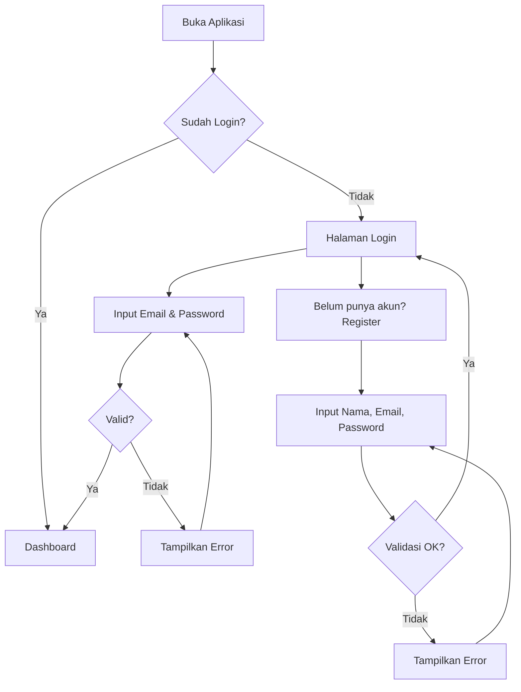
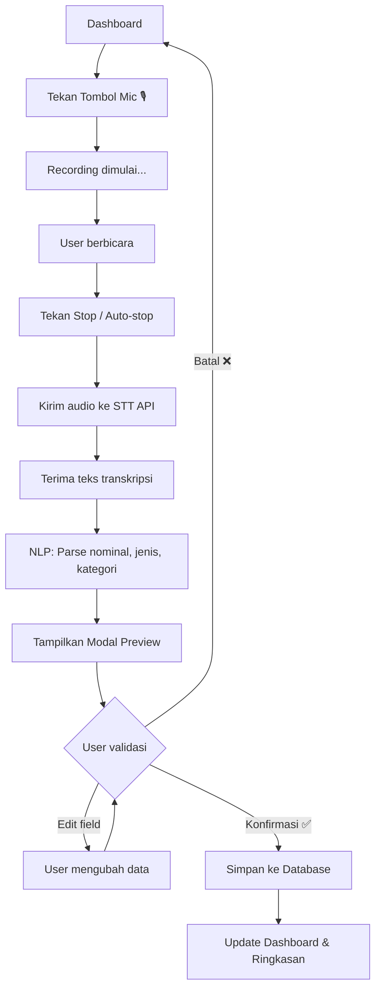
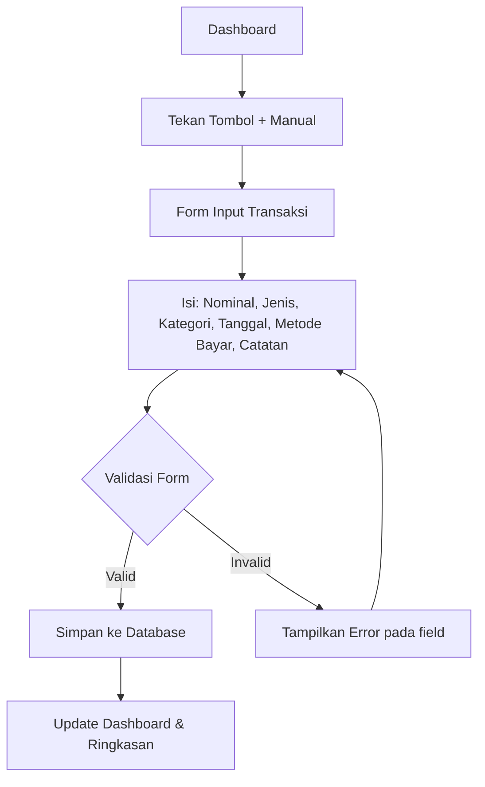
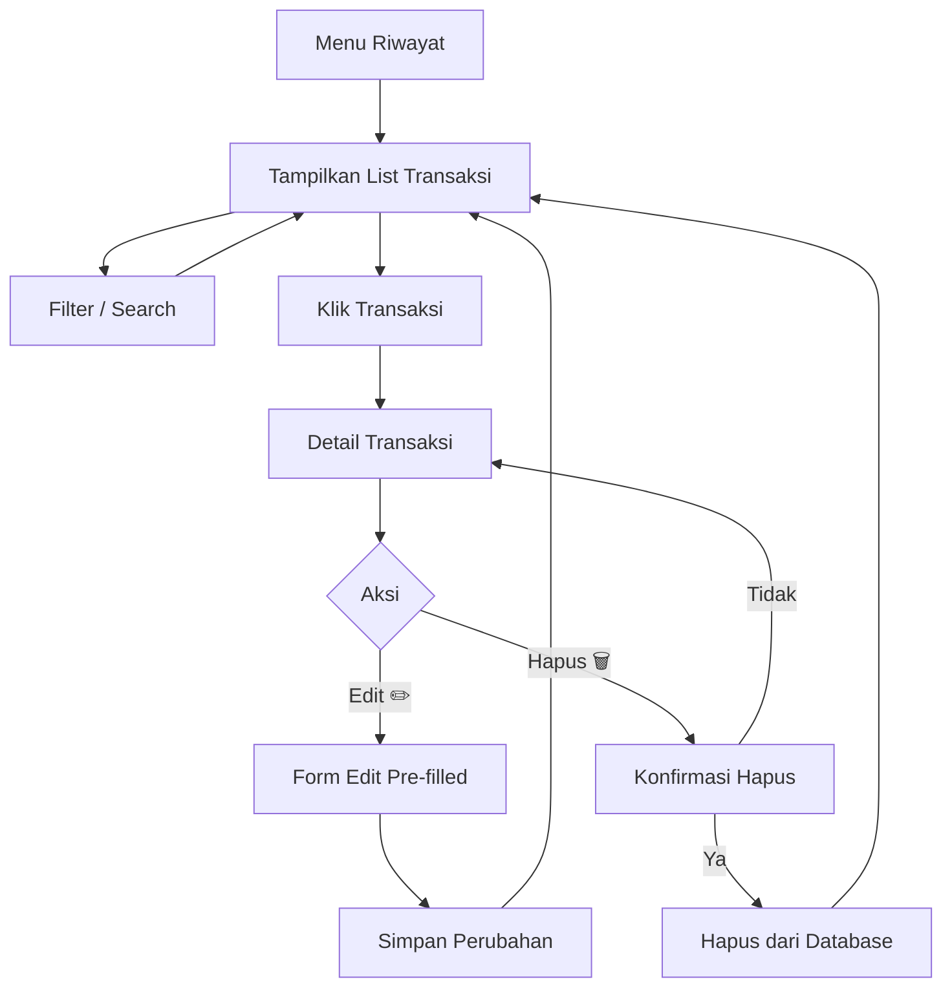
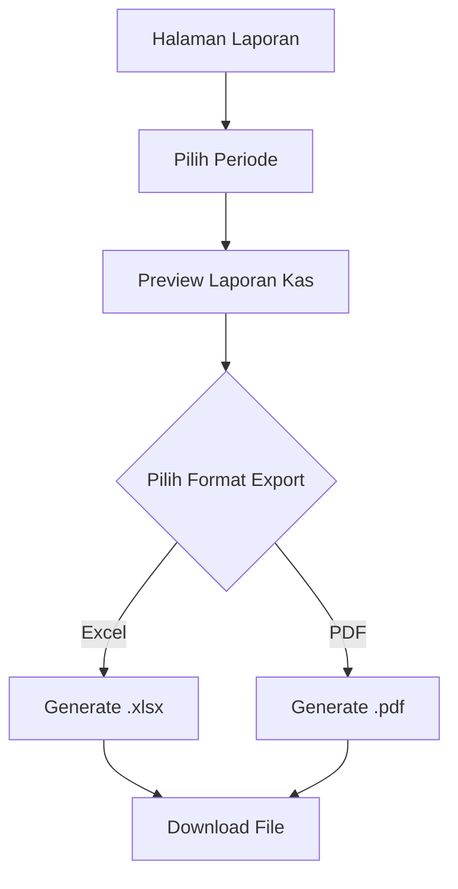
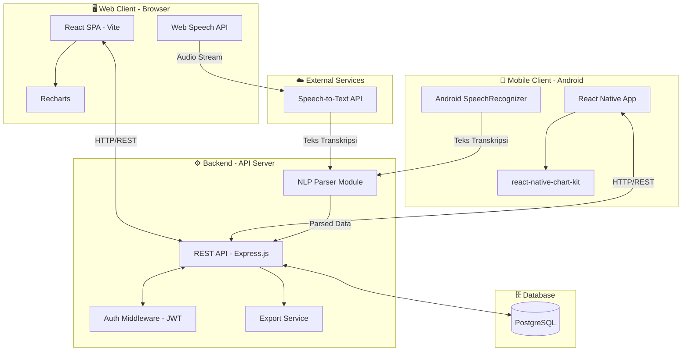
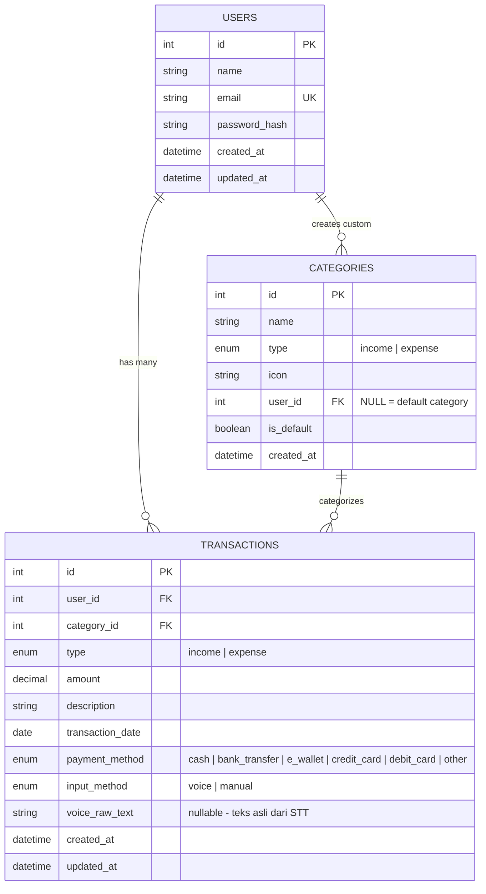
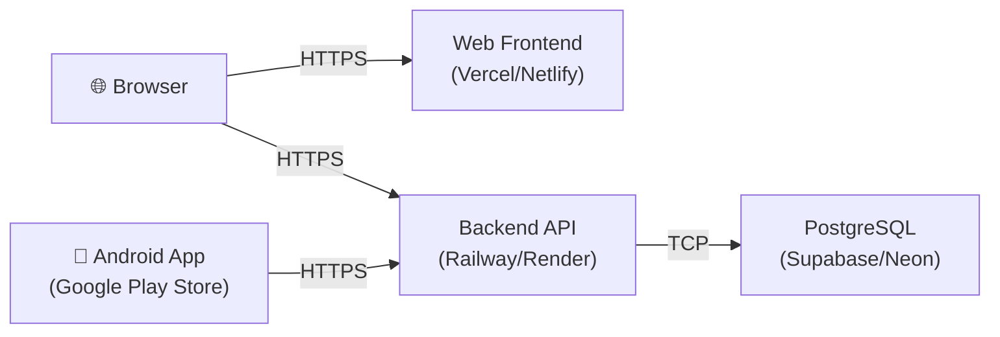

# 📄 PRD — KUSKAS (Keuangan Sakti Kas)

**Aplikasi Pencatatan Keuangan Pribadi dengan Voice Input**

| Field            | Detail                                          |
| ---------------- | ----------------------------------------------- |
| **Versi**        | 1.1                                              |
| **Tanggal**      | 11 Juni 2026                                     |
| **Author**       | —                                                |
| **Status**       | Draft                                            |
| **Platform**     | Web Application (Responsive) + Android App       |

---

## 1. Overview

### 1.1 Latar Belakang

Banyak orang kesulitan mencatat keuangan harian karena prosesnya dianggap merepotkan. Pengguna harus membuka aplikasi, memilih kategori, mengetik nominal, dan mengisi detail lainnya secara manual. Proses ini membuat banyak transaksi terlewat dari pencatatan.

### 1.2 Solusi

**KUSKAS** adalah aplikasi pencatatan keuangan pribadi **multi-platform (Web & Android)** yang memprioritaskan **kemudahan input melalui rekam suara**. Pengguna cukup menekan tombol mikrofon dan berkata:

> *"Saya membeli jajan lima puluh ribu"*

Aplikasi secara otomatis akan:
1. Mentranskripsi suara menjadi teks
2. Mengekstrak nominal → `Rp 50.000`
3. Mengidentifikasi jenis → `Pengeluaran`
4. Mengkategorikan → `Makanan & Minuman`
5. Mengkategorikan → `metode pembayaran`  dan `tanggal`
6. Menampilkan hasil untuk **validasi pengguna** sebelum disimpan

Selain voice input, pengguna juga dapat melakukan **input manual** seperti pada umumnya.

### 1.5 Platform Strategy

| Platform     | Teknologi         | Keterangan                                                      |
|--------------|-------------------|-----------------------------------------------------------------|
| **Web**      | React.js (Vite)   | Akses via browser, responsive mobile-first design               |
| **Android**  | React Native      | Aplikasi native Android, satu codebase shared logic dengan web  |

> **Catatan:** Kedua platform menggunakan **backend API yang sama** sehingga data pengguna tersinkronisasi otomatis. Core business logic (NLP parsing, kalkulasi, dll.) di-share melalui shared JavaScript modules.

### 1.3 Tujuan Produk

| # | Tujuan                                                                 |
|---|------------------------------------------------------------------------|
| 1 | Mempermudah pencatatan keuangan melalui input suara                    |
| 2 | Memberikan ringkasan keuangan (pemasukan, pengeluaran, sisa saldo)     |
| 3 | Menyediakan visualisasi grafik dan laporan kas yang komprehensif       |
| 4 | Mendukung export data ke Excel dan PDF                                 |
| 5 | Menjaga keamanan data pengguna melalui sistem autentikasi              |

### 1.4 Target Pengguna

- Individu yang ingin mencatat keuangan pribadi dengan cepat
- Pekerja/mahasiswa yang memiliki banyak transaksi harian kecil
- Pengguna yang lebih nyaman berbicara daripada mengetik
- Pengguna Android yang menginginkan aplikasi keuangan ringan dan cepat

---

## 2. Requirements

### 2.1 Functional Requirements

| ID      | Requirement                                                                 | Prioritas |
|---------|-----------------------------------------------------------------------------|-----------|
| FR-01   | Sistem dapat merekam suara pengguna dan mentranskripsinya menjadi teks      | **P0**    |
| FR-02   | Sistem dapat mengekstrak nominal, jenis (pemasukan/pengeluaran), dan kategori dari teks transkripsi | **P0** |
| FR-03   | Sistem menampilkan hasil parsing suara untuk validasi sebelum disimpan      | **P0**    |
| FR-04   | Pengguna dapat menginput transaksi secara manual (nominal, jenis, tanggal, metode pembayaran, catatan) | **P0** |
| FR-05   | Sistem menampilkan ringkasan: total pemasukan, total pengeluaran, dan sisa (pemasukan − pengeluaran) | **P0** |
| FR-06   | Pengguna dapat melihat riwayat transaksi dengan filter dan pencarian       | **P0**    |
| FR-07   | Sistem menampilkan grafik/chart dari data transaksi                        | **P1**    |
| FR-08   | Sistem menghasilkan laporan kas berdasarkan periode tertentu               | **P1**    |
| FR-09   | Pengguna dapat mengexport data ke format Excel (.xlsx) dan PDF             | **P1**    |
| FR-10   | Sistem memiliki autentikasi login (register, login, logout)                | **P0**    |
| FR-11   | Pengguna dapat mengedit dan menghapus transaksi yang sudah tercatat        | **P0**    |
| FR-12   | Sistem menyediakan kategori default dan memungkinkan custom kategori       | **P2**    |

### 2.2 Non-Functional Requirements

| ID       | Requirement                                                               | Prioritas |
|----------|---------------------------------------------------------------------------|-----------|
| NFR-01   | Aplikasi web harus responsif (mobile-first design)                        | **P0**    |
| NFR-02   | Waktu respons transkripsi suara ≤ 3 detik                                 | **P0**    |
| NFR-03   | Data pengguna terenkripsi (password hashing, HTTPS)                       | **P0**    |
| NFR-04   | Aplikasi dapat menangani minimal 1000 transaksi per user tanpa degradasi  | **P1**    |
| NFR-05   | UI/UX intuitif, dapat digunakan tanpa tutorial                            | **P0**    |
| NFR-06   | Sistem mendukung bahasa Indonesia sebagai bahasa utama untuk voice input   | **P0**    |
| NFR-07   | Aplikasi Android mendukung minimum Android 8.0 (API level 26)            | **P0**    |
| NFR-08   | Ukuran APK/AAB ≤ 30 MB                                                    | **P1**    |
| NFR-09   | Data tersinkronisasi antara platform web dan Android melalui backend API  | **P0**    |
| NFR-10   | Aplikasi Android berjalan smooth di perangkat RAM 2GB+                    | **P1**    |

---

## 3. Core Features

### 3.1 🎙️ Voice Input (Pencatatan via Suara)

Fitur utama yang membedakan KUSKAS dari aplikasi keuangan lainnya.

**Alur Kerja:**

```
[Tekan Tombol Mic] → [Rekam Suara] → [Transkripsi STT] → [NLP Parsing] → [Preview Hasil] → [Validasi User] → [Simpan]
```

**Detail:**

| Aspek              | Deskripsi                                                                                   |
|---------------------|---------------------------------------------------------------------------------------------|
| **Trigger**         | Tombol mikrofon floating (FAB) yang selalu terlihat di layar                               |
| **Recording (Web)** | Menggunakan Web Speech API (browser) untuk speech-to-text                                  |
| **Recording (Android)** | Menggunakan Android Native Speech Recognition (`SpeechRecognizer`) atau `react-native-voice` |
| **Parsing**         | NLP engine mengekstrak: nominal, jenis transaksi, kategori, dan deskripsi                  |
| **Preview**         | Modal konfirmasi menampilkan hasil parsing dalam bentuk form yang bisa diedit              |
| **Validasi**        | User dapat mengubah field apapun sebelum menekan "Simpan"                                  |
| **Metode Bayar**    | Jika tidak terdeteksi dari suara, user memilih manual di form preview                      |
| **Permission (Android)** | Meminta izin `RECORD_AUDIO` saat pertama kali menggunakan fitur voice                |

**Contoh Input Suara dan Hasil Parsing:**

| Input Suara                                      | Nominal     | Jenis        | Kategori            | Deskripsi       |
|--------------------------------------------------|-------------|--------------|---------------------|-----------------|
| *"Saya membeli jajan 50.000"*                    | Rp 50.000   | Pengeluaran  | Makanan & Minuman   | Membeli jajan   |
| *"Gaji bulan ini 5 juta"*                        | Rp 5.000.000| Pemasukan    | Gaji                | Gaji bulan ini  |
| *"Bayar listrik 350 ribu"*                       | Rp 350.000  | Pengeluaran  | Tagihan & Utilitas  | Bayar listrik   |
| *"Terima transfer dari client 2 juta"*           | Rp 2.000.000| Pemasukan    | Freelance           | Transfer client |
| *"Isi bensin 100 ribu"*                          | Rp 100.000  | Pengeluaran  | Transportasi        | Isi bensin      |

**Keyword Mapping (NLP Rules):**

| Keyword Indikator                                    | Mapping          |
|------------------------------------------------------|------------------|
| beli, bayar, isi, langganan, cicil, sewa             | → Pengeluaran    |
| gaji, terima, dapat, transfer masuk, bonus, refund   | → Pemasukan      |

---

### 3.2 ✏️ Input Manual

Form input standar untuk pengguna yang memilih mengetik manual.

**Field Form:**

| Field               | Tipe Input      | Required | Keterangan                                       |
|---------------------|-----------------|----------|--------------------------------------------------|
| Nominal             | Number          | ✅       | Auto-format ke format Rupiah                     |
| Jenis Transaksi     | Select          | ✅       | Pemasukan / Pengeluaran                          |
| Kategori            | Select          | ✅       | Dropdown berdasarkan jenis (lihat daftar kategori) |
| Tanggal             | Date Picker     | ✅       | Default: hari ini                                |
| Metode Pembayaran   | Select          | ✅       | Cash, Transfer Bank, E-Wallet, Kartu Kredit, dll |
| Catatan/Deskripsi   | Text            | ❌       | Opsional, untuk detail tambahan                  |

**Daftar Kategori Default:**

| Pengeluaran                | Pemasukan            |
|----------------------------|----------------------|
| 🍔 Makanan & Minuman      | 💰 Gaji             |
| 🚗 Transportasi           | 💼 Freelance         |
| 🏠 Tempat Tinggal         | 🎁 Bonus            |
| ⚡ Tagihan & Utilitas      | 📈 Investasi         |
| 🛒 Belanja                | 🔄 Transfer Masuk    |
| 🎮 Hiburan                | 💵 Lainnya           |
| 💊 Kesehatan              |                      |
| 📚 Pendidikan             |                      |
| 👕 Fashion                |                      |
| 💵 Lainnya                |                      |

---

### 3.3 📊 Dashboard & Ringkasan Keuangan

Halaman utama yang menampilkan snapshot kondisi keuangan pengguna.

**Komponen Dashboard:**

| Komponen                    | Deskripsi                                                  |
|-----------------------------|-------------------------------------------------------------|
| **Card Pemasukan**          | Total pemasukan pada periode yang dipilih (warna hijau)    |
| **Card Pengeluaran**        | Total pengeluaran pada periode yang dipilih (warna merah)  |
| **Card Sisa/Saldo**         | Pemasukan − Pengeluaran (warna biru/kuning)                |
| **Transaksi Terakhir**      | 5–10 transaksi terbaru                                     |
| **Quick Action Buttons**    | Tombol cepat: + Voice, + Manual                            |
| **Mini Chart**              | Grafik ringkas trend pengeluaran 7 hari terakhir           |

**Filter Periode:**
- Hari ini
- Minggu ini
- Bulan ini
- Custom range (date picker)

---

### 3.4 📜 Riwayat Transaksi

Daftar lengkap semua transaksi yang telah dicatat.

**Fitur:**

| Fitur            | Deskripsi                                                          |
|------------------|--------------------------------------------------------------------|
| **List View**    | Tampilan daftar transaksi dengan scroll infinite / pagination      |
| **Filter**       | By jenis (pemasukan/pengeluaran), kategori, metode bayar, tanggal |
| **Search**       | Pencarian by deskripsi/catatan                                     |
| **Sort**         | By tanggal (terbaru/terlama), nominal (terbesar/terkecil)         |
| **Detail View**  | Tap/klik untuk melihat detail lengkap transaksi                   |
| **Edit/Delete**  | Aksi edit dan hapus pada setiap item transaksi                    |
| **Group by Date**| Transaksi dikelompokkan per tanggal                               |

---

### 3.5 📈 Grafik & Chart

Visualisasi data keuangan untuk memudahkan analisis.

**Jenis Grafik:**

| Grafik                        | Tipe Chart     | Deskripsi                                           |
|-------------------------------|----------------|-----------------------------------------------------|
| Trend Pemasukan vs Pengeluaran| Line Chart     | Perbandingan harian/mingguan/bulanan                |
| Distribusi Pengeluaran        | Pie/Donut Chart| Breakdown pengeluaran per kategori                  |
| Distribusi Pemasukan          | Pie/Donut Chart| Breakdown pemasukan per kategori                    |
| Bar Bulanan                   | Bar Chart      | Perbandingan pemasukan vs pengeluaran per bulan     |
| Saldo Berjalan                | Area Chart     | Pergerakan saldo dari waktu ke waktu                |

**Interaksi:**
- Hover/tap untuk melihat detail angka
- Filter by periode (mingguan, bulanan, tahunan)
- Toggle show/hide dataset

---

### 3.6 📋 Laporan Kas

Ringkasan keuangan dalam format laporan formal.

**Isi Laporan:**

```
╔════════════════════════════════════════════════╗
║          LAPORAN KAS — Juni 2026               ║
╠════════════════════════════════════════════════╣
║                                                ║
║  Saldo Awal Periode       : Rp  2.500.000     ║
║                                                ║
║  Total Pemasukan           : Rp  7.000.000     ║
║    ├─ Gaji                 : Rp  5.000.000     ║
║    ├─ Freelance            : Rp  1.500.000     ║
║    └─ Lainnya              : Rp    500.000     ║
║                                                ║
║  Total Pengeluaran         : Rp  4.200.000     ║
║    ├─ Makanan & Minuman    : Rp  1.200.000     ║
║    ├─ Transportasi         : Rp    800.000     ║
║    ├─ Tagihan              : Rp  1.000.000     ║
║    └─ Lainnya              : Rp  1.200.000     ║
║                                                ║
║  Sisa / Saldo Akhir        : Rp  5.300.000     ║
║                                                ║
╚════════════════════════════════════════════════╝
```

**Filter Laporan:**
- Harian, Mingguan, Bulanan, Tahunan
- Custom date range

---

### 3.7 📤 Export Data

Kemampuan export data ke format yang umum digunakan.

| Format   | Konten                                                          |
|----------|-----------------------------------------------------------------|
| **Excel** (.xlsx) | Tabel transaksi lengkap, sheet ringkasan, sheet per kategori |
| **PDF**           | Laporan kas terformat rapi dengan header, tabel, dan grafik  |

**Opsi Export:**
- Export semua data
- Export berdasarkan filter periode
- Export berdasarkan jenis (pemasukan saja / pengeluaran saja / semua)

---

### 3.8 🔐 Autentikasi User

| Fitur              | Deskripsi                                                 |
|---------------------|-----------------------------------------------------------|
| **Register**        | Nama, email, password                                     |
| **Login**           | Email + password                                          |
| **Logout**          | Hapus session/token                                       |
| **Session**         | JWT-based authentication                                  |
| **Password**        | Minimum 8 karakter, harus mengandung huruf dan angka      |
| **Protected Routes**| Semua halaman kecuali login/register memerlukan auth      |

---

## 4. User Flow

### 4.1 Flow Registrasi & Login



### 4.2 Flow Input via Suara



### 4.3 Flow Input Manual



### 4.4 Flow Riwayat & Edit Transaksi



### 4.5 Flow Export



---

## 5. Architecture

### 5.1 High-Level Architecture



### 5.2 Web Frontend Architecture

```
web/
├── src/
│   ├── assets/                    # Gambar, icon, font
│   ├── components/
│   │   ├── common/                # Button, Card, Modal, Input, etc.
│   │   ├── dashboard/             # DashboardCards, MiniChart, RecentTransactions
│   │   ├── transaction/           # TransactionForm, TransactionList, TransactionItem
│   │   ├── voice/                 # VoiceRecorder, VoicePreviewModal
│   │   ├── chart/                 # LineChart, PieChart, BarChart
│   │   ├── report/                # CashReport, ReportFilter
│   │   └── auth/                  # LoginForm, RegisterForm
│   ├── pages/
│   │   ├── DashboardPage
│   │   ├── TransactionHistoryPage
│   │   ├── ChartPage
│   │   ├── ReportPage
│   │   ├── LoginPage
│   │   └── RegisterPage
│   ├── hooks/                     # useAuth, useVoice, useTransactions
│   ├── context/                   # AuthContext, TransactionContext
│   ├── services/                  # api.js, voiceService.js, exportService.js
│   ├── utils/                     # formatCurrency, dateHelper, nlpParser
│   ├── styles/                    # CSS files / design tokens
│   └── App.jsx
├── public/
└── package.json
```

### 5.3 Mobile (Android) Architecture

```
mobile/
├── src/
│   ├── assets/                    # Gambar, icon, font
│   ├── components/
│   │   ├── common/                # Button, Card, Modal, Input (React Native)
│   │   ├── dashboard/             # DashboardCards, MiniChart, RecentTransactions
│   │   ├── transaction/           # TransactionForm, TransactionList, TransactionItem
│   │   ├── voice/                 # VoiceRecorder, VoicePreviewModal
│   │   ├── chart/                 # LineChart, PieChart, BarChart
│   │   ├── report/                # CashReport, ReportFilter
│   │   └── auth/                  # LoginForm, RegisterForm
│   ├── screens/
│   │   ├── DashboardScreen
│   │   ├── TransactionHistoryScreen
│   │   ├── ChartScreen
│   │   ├── ReportScreen
│   │   ├── LoginScreen
│   │   └── RegisterScreen
│   ├── navigation/                # React Navigation stack & tab navigators
│   ├── hooks/                     # useAuth, useVoice, useTransactions
│   ├── context/                   # AuthContext, TransactionContext
│   ├── services/                  # api.js, voiceService.js, exportService.js
│   ├── utils/                     # formatCurrency, dateHelper, nlpParser
│   └── App.tsx
├── android/                       # Android native project
├── ios/                           # (optional for future iOS support)
└── package.json
```

### 5.4 Shared Modules

Logic yang di-share antara Web dan Mobile:

```
shared/
├── constants/
│   ├── categories.js              # Daftar kategori default
│   └── paymentMethods.js          # Daftar metode pembayaran
├── utils/
│   ├── nlpParser.js               # Voice text → structured transaction
│   ├── currencyFormatter.js       # Format Rupiah
│   └── dateHelper.js              # Utility tanggal
├── types/
│   └── transaction.js             # Type definitions / interfaces
└── validators/
    └── transactionValidator.js    # Validasi input transaksi
```

### 5.5 Backend Architecture

```
server/
├── config/                    # Database config, environment variables
├── controllers/
│   ├── authController.js
│   ├── transactionController.js
│   ├── reportController.js
│   └── exportController.js
├── middleware/
│   ├── authMiddleware.js      # JWT verification
│   ├── errorHandler.js
│   └── validator.js           # Input validation
├── models/
│   ├── User.js
│   ├── Transaction.js
│   └── Category.js
├── routes/
│   ├── authRoutes.js
│   ├── transactionRoutes.js
│   ├── reportRoutes.js
│   └── exportRoutes.js
├── services/
│   ├── nlpService.js          # Voice text parsing logic
│   ├── exportService.js       # Excel & PDF generation
│   └── reportService.js       # Aggregation queries
├── utils/
│   ├── jwtHelper.js
│   └── currencyParser.js
└── server.js
```

### 5.6 API Endpoints

#### Auth

| Method | Endpoint              | Deskripsi              | Auth  |
|--------|-----------------------|------------------------|-------|
| POST   | `/api/auth/register`  | Register user baru     | ❌    |
| POST   | `/api/auth/login`     | Login & dapatkan token | ❌    |
| GET    | `/api/auth/me`        | Get current user info  | ✅    |
| POST   | `/api/auth/logout`    | Logout (invalidate)    | ✅    |

#### Transactions

| Method | Endpoint                          | Deskripsi                        | Auth  |
|--------|-----------------------------------|----------------------------------|-------|
| GET    | `/api/transactions`               | List transaksi (filter, sort, paginate) | ✅ |
| GET    | `/api/transactions/:id`           | Detail transaksi                 | ✅    |
| POST   | `/api/transactions`               | Buat transaksi baru              | ✅    |
| PUT    | `/api/transactions/:id`           | Update transaksi                 | ✅    |
| DELETE | `/api/transactions/:id`           | Hapus transaksi                  | ✅    |
| POST   | `/api/transactions/voice-parse`   | Parse teks suara → transaksi     | ✅    |

#### Reports & Export

| Method | Endpoint                        | Deskripsi                                | Auth  |
|--------|---------------------------------|------------------------------------------|-------|
| GET    | `/api/reports/summary`          | Ringkasan pemasukan, pengeluaran, sisa   | ✅    |
| GET    | `/api/reports/cash-report`      | Laporan kas by periode                   | ✅    |
| GET    | `/api/reports/chart-data`       | Data untuk grafik (aggregated)           | ✅    |
| GET    | `/api/export/excel`             | Download file Excel                      | ✅    |
| GET    | `/api/export/pdf`               | Download file PDF                        | ✅    |

#### Categories

| Method | Endpoint                  | Deskripsi                    | Auth  |
|--------|---------------------------|------------------------------|-------|
| GET    | `/api/categories`         | List semua kategori          | ✅    |
| POST   | `/api/categories`         | Buat kategori custom         | ✅    |

---

## 6. Database Schema

### 6.1 Entity Relationship Diagram



### 6.2 Tabel Detail

#### `users`

| Column          | Type         | Constraint       | Deskripsi                    |
|-----------------|--------------|------------------|------------------------------|
| `id`            | INT          | PK, AUTO_INC     | Primary key                  |
| `name`          | VARCHAR(100) | NOT NULL          | Nama lengkap user            |
| `email`         | VARCHAR(255) | UNIQUE, NOT NULL  | Email untuk login            |
| `password_hash` | VARCHAR(255) | NOT NULL          | Bcrypt hashed password       |
| `created_at`    | TIMESTAMP    | DEFAULT NOW()     | Waktu registrasi             |
| `updated_at`    | TIMESTAMP    | ON UPDATE NOW()   | Waktu update terakhir        |

#### `categories`

| Column       | Type         | Constraint        | Deskripsi                             |
|--------------|--------------|--------------------|-----------------------------------------|
| `id`         | INT          | PK, AUTO_INC      | Primary key                             |
| `name`       | VARCHAR(50)  | NOT NULL           | Nama kategori                           |
| `type`       | ENUM         | 'income','expense' | Tipe kategori                           |
| `icon`       | VARCHAR(10)  | NULLABLE           | Emoji icon                              |
| `user_id`    | INT          | FK → users.id, NULLABLE | NULL = kategori default sistem     |
| `is_default` | BOOLEAN      | DEFAULT false      | Apakah kategori bawaan sistem           |
| `created_at` | TIMESTAMP    | DEFAULT NOW()      | Waktu pembuatan                         |

#### `transactions`

| Column             | Type          | Constraint               | Deskripsi                              |
|--------------------|---------------|--------------------------|----------------------------------------|
| `id`               | INT           | PK, AUTO_INC             | Primary key                            |
| `user_id`          | INT           | FK → users.id, NOT NULL  | Relasi ke user                         |
| `category_id`      | INT           | FK → categories.id       | Relasi ke kategori                     |
| `type`             | ENUM          | 'income', 'expense'      | Jenis transaksi                        |
| `amount`           | DECIMAL(15,2) | NOT NULL                 | Nominal transaksi                      |
| `description`      | VARCHAR(500)  | NULLABLE                 | Keterangan transaksi                   |
| `transaction_date` | DATE          | NOT NULL                 | Tanggal transaksi                      |
| `payment_method`   | ENUM          | NOT NULL                 | Metode pembayaran                      |
| `input_method`     | ENUM          | 'voice', 'manual'        | Cara input (untuk analytics)           |
| `voice_raw_text`   | TEXT          | NULLABLE                 | Teks mentah dari speech-to-text        |
| `created_at`       | TIMESTAMP     | DEFAULT NOW()            | Waktu pencatatan                       |
| `updated_at`       | TIMESTAMP     | ON UPDATE NOW()          | Waktu update terakhir                  |

### 6.3 Indexes

```sql
-- Performance indexes
CREATE INDEX idx_transactions_user_id ON transactions(user_id);
CREATE INDEX idx_transactions_type ON transactions(user_id, type);
CREATE INDEX idx_transactions_date ON transactions(user_id, transaction_date);
CREATE INDEX idx_transactions_category ON transactions(category_id);
CREATE INDEX idx_categories_user ON categories(user_id);
CREATE UNIQUE INDEX idx_users_email ON users(email);
```

---

## 7. Tech Stack

### 7.1 Frontend — Web

| Layer              | Teknologi                    | Alasan                                               |
|--------------------|------------------------------|------------------------------------------------------|
| **Framework**      | React.js (Vite)              | Ekosistem besar, performa cepat dengan Vite          |
| **Routing**        | React Router v6              | Client-side routing standar                          |
| **State**          | React Context + useReducer   | Cukup untuk skala personal app, tanpa overhead Redux |
| **HTTP Client**    | Axios                        | Interceptor untuk auth token, error handling         |
| **Charts**         | Recharts                     | React-native charting, mudah dikustomisasi           |
| **Styling**        | Vanilla CSS (CSS Custom Properties) | Fleksibel, ringan, design system dengan CSS variables |
| **Icons**          | Lucide React                 | Modern, ringan, konsisten                            |
| **Date Picker**    | react-datepicker             | Mudah digunakan, ringan                              |
| **Voice / STT**    | Web Speech API (browser)     | Gratis, native browser, mendukung Bahasa Indonesia   |
| **Notifications**  | React Hot Toast              | Notifikasi ringan dan elegan                         |

### 7.2 Frontend — Android (React Native)

| Layer              | Teknologi                            | Alasan                                                   |
|--------------------|--------------------------------------|----------------------------------------------------------|
| **Framework**      | React Native (Expo / Bare Workflow)  | Cross-platform dengan shared logic, ekosistem React      |
| **Navigation**     | React Navigation v6                  | Standar navigasi untuk React Native (stack, tab, drawer) |
| **State**          | React Context + useReducer           | Konsisten dengan versi web                               |
| **HTTP Client**    | Axios                                | API layer yang sama dengan web                           |
| **Charts**         | react-native-chart-kit               | Chart library ringan untuk React Native                  |
| **Styling**        | React Native StyleSheet              | Native styling engine bawaan RN                          |
| **Icons**          | react-native-vector-icons (Lucide)   | Icon set yang konsisten dengan versi web                  |
| **Date Picker**    | @react-native-community/datetimepicker | Native date picker untuk Android                       |
| **Voice / STT**    | @react-native-voice/voice            | Native Android SpeechRecognizer binding                  |
| **Notifications**  | react-native-toast-message           | Toast notifications native-feel                          |
| **Storage**        | @react-native-async-storage          | Local storage untuk token JWT dan cache                  |
| **File Sharing**   | react-native-share                   | Sharing file export (PDF/Excel) ke app lain              |
| **Permissions**    | react-native-permissions             | Manajemen izin (mikrofon, penyimpanan)                   |

### 7.3 Backend

| Layer              | Teknologi                    | Alasan                                               |
|--------------------|------------------------------|------------------------------------------------------|
| **Runtime**        | Node.js                      | JavaScript full-stack, non-blocking I/O              |
| **Framework**      | Express.js                   | Minimalis, fleksibel, ekosistem middleware besar     |
| **Database**       | PostgreSQL                   | Robust, ACID compliant, query aggregasi kuat         |
| **ORM**            | Prisma                       | Type-safe, migration mudah, DX bagus                 |
| **Auth**           | JWT (jsonwebtoken) + Bcrypt  | Stateless auth, password hashing standar industri    |
| **Validation**     | Joi / Zod                    | Schema validation untuk request body                 |
| **NLP Parsing**    | Custom regex + keyword matching | Cukup untuk parsing kalimat keuangan sederhana    |
| **Excel Export**   | ExcelJS                      | Pembuatan file .xlsx yang kaya fitur                 |
| **PDF Export**     | PDFKit / Puppeteer           | Generasi PDF terformat rapi                          |
| **CORS**           | cors middleware               | Mengizinkan akses cross-origin dari frontend         |

### 7.4 DevOps & Tools

| Layer              | Teknologi                    | Alasan                                               |
|--------------------|------------------------------|------------------------------------------------------|
| **Version Control**| Git + GitHub                 | Standar industri                                     |
| **Package Manager**| npm                          | Default untuk Node.js ecosystem                      |
| **Environment**    | dotenv                       | Manajemen environment variables                      |
| **API Testing**    | Postman / Thunder Client     | Testing endpoint selama development                  |
| **Linting**        | ESLint + Prettier            | Konsistensi kode                                     |
| **Android Build**  | Gradle / EAS Build (Expo)    | Build APK/AAB untuk distribusi                       |
| **CI/CD**          | GitHub Actions               | Automated build, test, dan deploy                    |

### 7.5 Arsitektur Deployment



**Distribusi Android:**

| Channel              | Deskripsi                                               |
|----------------------|---------------------------------------------------------|
| **Google Play Store**| Distribusi utama untuk pengguna akhir (AAB format)      |
| **APK Direct**       | Distribusi langsung via link download (testing/beta)    |
| **Internal Testing** | Google Play Console internal testing track              |

---

## Appendix

### A. Catatan Pengembangan

> **Note:**
> - **Phase 1 (MVP Web):** Auth + Manual Input + Dashboard + Riwayat Transaksi (Web)
> - **Phase 2 (Voice + Charts):** Voice Input + NLP Parsing + Grafik (Web)
> - **Phase 3 (Reports):** Laporan Kas + Export Excel/PDF (Web)
> - **Phase 4 (Android):** Porting ke React Native, build Android app, Google Play Store
> - **Phase 5 (Polish):** Custom Kategori + Polish UI/UX + Sinkronisasi lintas platform

### B. Glossary

| Istilah       | Definisi                                                                |
|---------------|-------------------------------------------------------------------------|
| **STT**       | Speech-to-Text — konversi suara ke teks                                |
| **NLP**       | Natural Language Processing — pemrosesan bahasa alami                  |
| **JWT**       | JSON Web Token — standar token untuk autentikasi                       |
| **FAB**       | Floating Action Button — tombol aksi mengambang di UI                  |
| **CRUD**      | Create, Read, Update, Delete — operasi dasar data                      |
| **RN**        | React Native — framework untuk membangun aplikasi mobile               |
| **APK**       | Android Package Kit — format distribusi aplikasi Android               |
| **AAB**       | Android App Bundle — format distribusi Play Store                      |
| **EAS**       | Expo Application Services — build & deploy service untuk React Native  |

---

*Dokumen ini bersifat living document dan akan diperbarui sesuai perkembangan proyek.*
