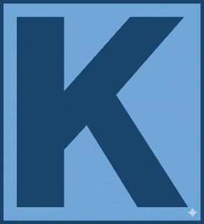

<p align="center">
  
</p>

<h1 align="center">KUSKAS — Keuangan Sakti Kas</h1>

<p align="center">
  <strong>Aplikasi pencatatan keuangan pribadi dengan voice input & QR Code login</strong>
</p>

<p align="center">
  
  
  
  
  
  
  
</p>

<p align="center">
  <a href="https://projek-kuskas-app-web.onrender.com">
    
  </a>
  &nbsp;&nbsp;
  <a href="https://github.com/boyharendy/Projek_Kuskas_App_Web/releases/latest">
    
  </a>
</p>

---

## 📖 Tentang Proyek

**KUSKAS** (*Keuangan Sakti Kas*) adalah ekosistem aplikasi keuangan pribadi yang terdiri dari **aplikasi mobile Android (Flutter)** dan **web admin panel (Laravel + React)**. Proyek ini dirancang untuk mempermudah pencatatan keuangan harian dengan pendekatan modern — cukup **rekam suara** atau **ketik manual**, dan KUSKAS akan otomatis mengkategorikan transaksi Anda.

> *"Saya membeli jajan lima puluh ribu"* → Aplikasi secara otomatis mengekstrak nominal, jenis transaksi, dan kategori.

### ✨ Mengapa KUSKAS?

| Masalah | Solusi KUSKAS |
|---------|---------------|
| Malas mencatat keuangan karena ribet | **Voice Input** — cukup bicara, langsung tercatat |
| Data keuangan tersebar di mana-mana | **Sinkronisasi real-time** — satu database, semua platform |
| Tidak ada gambaran pengeluaran | **Dashboard & chart interaktif** — visualisasi instan |
| Sulit akses data dari komputer | **Web Admin Panel** — kelola dari browser manapun |
| Login web ribet ketik password | **QR Code Login** — scan dari HP, langsung masuk |

---

## 🏗️ Arsitektur Sistem

```
┌─────────────────────────────────────────────────────────────────────┐
│                        KUSKAS ECOSYSTEM                             │
├──────────────────┬────────────────────────┬─────────────────────────┤
│                  │                        │                         │
│  📱 Mobile App   │   🖥️ Web Admin Panel   │   🗄️ Database Layer    │
│  (Flutter/Dart)  │   (Laravel + React)    │   (Supabase/PostgreSQL) │
│                  │                        │                         │
│  • Voice Input   │   • QR Code Login      │   • Row Level Security  │
│  • Manual Input  │   • Dashboard          │   • UUID Primary Keys   │
│  • Dashboard     │   • Transactions CRUD  │   • Real-time Sync      │
│  • Chart & Stats │   • Reports & Export   │   • Auth Integration    │
│  • QR Scanner    │   • Profile Mgmt       │   • Edge Functions      │
│  • AI Advisor    │   • Charts (Recharts)  │                         │
│  • News Feed     │   • AI Financial Tips  │                         │
│                  │                        │                         │
└──────────────────┴────────────────────────┴─────────────────────────┘
                            │
              ┌─────────────┴──────────────┐
              │    ☁️ External Services     │
              │  • Google Gemini AI (NLP)   │
              │  • Supabase Auth            │
              │  • Speech-to-Text API       │
              │  • Render (Web Hosting)     │
              └────────────────────────────┘
```

---

## 📱 Mobile App (Flutter)

Aplikasi Android native yang dibangun dengan Flutter, memberikan pengalaman pengguna yang halus dan responsif.

### Fitur Utama

| Fitur | Deskripsi |
|-------|-----------|
| 🎙️ **Voice Input** | Rekam suara → transkripsi → NLP parsing otomatis (nominal, jenis, kategori) |
| ✏️ **Manual Input** | Form input lengkap dengan date picker dan kategori |
| 📊 **Dashboard** | Ringkasan keuangan dengan summary cards (pemasukan, pengeluaran, saldo) |
| 📈 **Chart & Statistik** | Grafik interaktif — Line chart, Pie chart, dan Bar chart dengan `fl_chart` |
| 📋 **Riwayat Transaksi** | List transaksi dengan filter, search, dan infinite scroll |
| 📄 **Laporan Kas** | Generate laporan keuangan per periode, export ke PDF & Excel |
| 🤖 **AI Financial Advisor** | Tips keuangan personal berbasis Google Gemini AI |
| 📰 **News Feed** | Berita keuangan terkini via RSS feed parser |
| 📷 **QR Scanner** | Scan QR Code untuk login web admin panel dari HP |
| 👤 **Profil** | Manajemen profil dengan avatar, edit nama, dan pengaturan akun |

### Struktur Proyek Flutter

```
flutter/lib/
├── main.dart                          # Entry point aplikasi
├── config/                            # Konfigurasi tema & warna
├── models/
│   └── transaction.dart               # Model data transaksi
├── screens/
│   ├── splash_screen.dart             # Splash screen animasi
│   ├── login_screen.dart              # Login dengan Supabase Auth
│   ├── register_screen.dart           # Registrasi akun baru
│   ├── dashboard_screen.dart          # Halaman utama & ringkasan
│   ├── add_transaction_screen.dart    # Form tambah transaksi (voice + manual)
│   ├── transaction_history_screen.dart# Riwayat transaksi
│   ├── chart_screen.dart              # Grafik & visualisasi data
│   ├── report_screen.dart             # Laporan kas & export
│   ├── profile_screen.dart            # Profil & pengaturan
│   ├── news_screen.dart               # Feed berita keuangan
│   └── qr_scanner_screen.dart         # Scanner QR untuk web login
├── services/
│   ├── ai_voice_parser.dart           # NLP parser via Google Gemini AI
│   ├── ai_advisor_service.dart        # AI financial advisor
│   └── notification_listener_service.dart
├── widgets/
│   ├── animated_background.dart       # Background animasi halus
│   ├── profile_avatar_button.dart     # Tombol avatar profil
│   ├── dashboard/                     # Widget summary cards & transaksi terbaru
│   ├── transaction/                   # Widget form & list transaksi
│   └── voice/                         # Widget voice recorder & preview
├── navigation/                        # Bottom navigation & routing
└── utils/                             # Utility helpers (format, cache, notifier)
```

### Dependencies Utama

| Package | Fungsi |
|---------|--------|
| `supabase_flutter` | Auth & database client |
| `speech_to_text` | Speech recognition native |
| `google_generative_ai` | Gemini AI untuk NLP parsing & advisor |
| `fl_chart` | Grafik interaktif (Line, Pie, Bar) |
| `mobile_scanner` | QR Code scanner |
| `pdf` | Generate laporan PDF |
| `excel` | Export data ke Excel |
| `image_picker` | Upload avatar profil |
| `google_fonts` | Typography modern |
| `provider` | State management |

---

## 🖥️ Web Admin Panel (Laravel + React)

Web admin panel dibangun dengan **Laravel 12** (backend) + **React 18** (frontend) menggunakan **Inertia.js** untuk pendekatan SPA monolitik yang modern.

### Fitur Utama

| Fitur | Deskripsi |
|-------|-----------|
| 🔐 **QR Code Login** | Login tanpa password — scan QR dari aplikasi mobile |
| 📊 **Dashboard** | Overview keuangan dengan area chart & pie chart (Recharts) |
| 💳 **Manajemen Transaksi** | CRUD transaksi lengkap dengan voice input via Web Speech API |
| 📈 **Charts Interaktif** | Visualisasi data dengan Recharts (Area, Pie, Bar) |
| 📋 **Laporan & Export** | Generate laporan kas, export ke PDF & Excel |
| 👤 **Profil Terintegrasi** | Profil tersinkronisasi dengan aplikasi mobile |
| 🤖 **AI Tips** | Tips keuangan dari Gemini AI langsung di dashboard |

### Cara Kerja QR Code Login

```
┌──────────────┐     ┌──────────────────┐     ┌──────────────────┐
│   Web Browser │     │   Laravel Server  │     │   Mobile App     │
│               │     │                   │     │                  │
│  1. Buka      │────▶│  2. Generate QR   │     │                  │
│     Login     │◀────│     Session       │     │                  │
│               │     │     (session_id   │     │                  │
│  3. Tampilkan │     │      + token)     │     │                  │
│     QR Code   │     │                   │     │                  │
│               │     │                   │     │  4. Scan QR      │
│               │     │                   │◀────│     Code         │
│               │     │  5. Authenticate  │     │  (kirim user_id  │
│               │     │     Session       │     │   + token)       │
│  7. Redirect  │◀────│  6. Login User    │     │                  │
│     Dashboard │     │     via Auth      │     │  8. Notifikasi   │
│               │     │                   │────▶│     Sukses ✅    │
└──────────────┘     └──────────────────┘     └──────────────────┘
```

### Struktur Proyek Web

```
web/
├── app/
│   ├── Http/Controllers/
│   │   ├── DashboardController.php        # Dashboard data & AI advice
│   │   ├── TransactionController.php      # CRUD transaksi + voice parse
│   │   ├── ReportController.php           # Laporan kas & export
│   │   ├── QrLoginController.php          # QR Code authentication
│   │   └── ProfileController.php          # Manajemen profil
│   └── Models/
│       ├── User.php                       # Model user (UUID-based)
│       └── WebQrSession.php               # Model QR login session
├── resources/js/
│   ├── Pages/
│   │   ├── Auth/Login.tsx                 # Halaman login + QR Code
│   │   ├── Dashboard.tsx                  # Dashboard + charts
│   │   ├── Transactions/Index.tsx         # Manajemen transaksi
│   │   ├── Report/Index.tsx               # Laporan kas
│   │   └── Profile/Edit.tsx               # Edit profil
│   ├── Components/                        # Reusable UI components
│   └── Layouts/                           # Layout templates
├── routes/
│   └── auth.php                           # Route definitions
├── database/migrations/                   # Schema migrations
└── Dockerfile                             # Multi-stage Docker build
```

### Tech Stack Web

| Layer | Teknologi |
|-------|-----------|
| **Backend** | Laravel 12, PHP 8.2 |
| **Frontend** | React 18, TypeScript, Inertia.js |
| **Styling** | TailwindCSS 3.x |
| **Charts** | Recharts 3.x |
| **Icons** | Lucide React |
| **Auth** | Laravel Breeze + Sanctum |
| **Build** | Vite 7, Docker multi-stage |
| **Hosting** | Render (Docker container) |

---

## 🗄️ Database (Supabase + PostgreSQL)

KUSKAS menggunakan **Supabase** sebagai Backend-as-a-Service, yang menyediakan PostgreSQL database dengan fitur enterprise-grade.

### Schema Database

```sql
┌──────────────────────┐       ┌────────────────────────────┐
│       USERS          │       │        TRANSACTIONS        │
├──────────────────────┤       ├────────────────────────────┤
│ id (UUID, PK)        │──┐    │ id (UUID, PK)              │
│ email (TEXT, UNIQUE)  │  │    │ user_id (UUID, FK) ────────│
│ full_name (TEXT)      │  │    │ type (income/expense)      │
│ avatar_url (TEXT)     │  │    │ amount (DECIMAL)           │
│ created_at (TIMESTZ)  │  │    │ category_name (TEXT)       │
│ updated_at (TIMESTZ)  │  │    │ description (TEXT)         │
└──────────────────────┘  │    │ transaction_date (TIMESTZ)  │
                          │    │ payment_method (TEXT)       │
┌──────────────────────┐  │    │ input_method (manual/voice)│
│     CATEGORIES       │  │    │ voice_raw_text (TEXT)       │
├──────────────────────┤  │    │ created_at (TIMESTZ)        │
│ id (UUID, PK)        │  │    │ updated_at (TIMESTZ)        │
│ user_id (UUID, FK) ──│──┘    └────────────────────────────┘
│ name (TEXT)           │
│ icon (TEXT)           │       ┌────────────────────────────┐
│ type (income/expense) │       │     WEB_QR_SESSIONS        │
│ created_at (TIMESTZ)  │       ├────────────────────────────┤
└──────────────────────┘       │ id (UUID, PK)              │
                               │ token (VARCHAR, UNIQUE)     │
                               │ user_id (UUID, FK, nullable)│
                               │ status (pending/auth/expired)│
                               │ expires_at (TIMESTAMP)       │
                               │ created_at / updated_at      │
                               └────────────────────────────┘
```

### Fitur Database

| Fitur | Deskripsi |
|-------|-----------|
| **Row Level Security (RLS)** | Setiap user hanya bisa akses data miliknya sendiri |
| **UUID Primary Keys** | ID unik global untuk integrasi multi-platform |
| **Supabase Auth** | Autentikasi built-in dengan email/password |
| **Edge Functions** | Serverless functions untuk voice parsing |
| **Real-time Sync** | Perubahan data langsung tersinkronisasi |
| **Kategori Default** | 9 kategori bawaan (6 pengeluaran + 3 pemasukan) |

### Kategori Default

| Pengeluaran | Pemasukan |
|-------------|-----------|
| 🛒 Konsumsi & Belanja | 💰 Penghasilan Utama |
| 📋 Tagihan & Kewajiban | 💼 Penghasilan Tambahan |
| 🚗 Transportasi | 📈 Investasi & Lainnya |
| 🎮 Gaya Hidup | |
| 🏥 Kesehatan & Edukasi | |
| 📦 Lainnya | |

---

## 🚀 Cara Menjalankan

### Prerequisites

| Tool | Versi Minimum |
|------|---------------|
| Flutter SDK | 3.12+ |
| PHP | 8.2+ |
| Composer | 2.x |
| Node.js | 20+ |
| npm | 9+ |

### 1️⃣ Clone Repository

```bash
git clone https://github.com/boyharendy/Projek_Kuskas_App_Web.git
cd Projek_Kuskas_App_Web
```

### 2️⃣ Setup Mobile App (Flutter)

```bash
cd flutter

# Buat file .env
cp .env.example .env
# Isi SUPABASE_URL dan SUPABASE_ANON_KEY di .env

# Install dependencies
flutter pub get

# Jalankan di emulator/device
flutter run
```

### 3️⃣ Setup Web Admin Panel (Laravel)

```bash
cd web

# Install PHP dependencies
composer install

# Install JS dependencies
npm install

# Buat file .env
cp .env.example .env
php artisan key:generate

# Konfigurasi database di .env (Supabase PostgreSQL)
# DB_CONNECTION=pgsql
# DB_HOST=<supabase-host>
# DB_PORT=5432
# DB_DATABASE=postgres
# DB_USERNAME=<username>
# DB_PASSWORD=<password>

# Jalankan migration
php artisan migrate

# Jalankan development server
composer dev
# Ini akan menjalankan: PHP server + Vite + Queue + Logs secara bersamaan
```

### 4️⃣ Build untuk Production

```bash
# Mobile App — Build APK
cd flutter
flutter build apk --release

# Web — Docker Build
docker build -t kuskas-web .
docker run -p 8080:80 kuskas-web
```

---

## 🔧 Environment Variables

### Flutter (`.env`)

```env
SUPABASE_URL=https://your-project.supabase.co
SUPABASE_ANON_KEY=your-anon-key
```

### Laravel Web (`.env`)

```env
APP_URL=https://your-domain.com
DB_CONNECTION=pgsql
DB_HOST=your-supabase-host.pooler.supabase.com
DB_PORT=5432
DB_DATABASE=postgres
DB_USERNAME=postgres.xxxxx
DB_PASSWORD=your-password
GEMINI_API_KEY=your-gemini-api-key
```

---

## 🤖 AI Integration (Google Gemini)

KUSKAS memanfaatkan **Google Gemini AI** untuk dua fitur cerdas:

### 1. Voice Parser (NLP)

Input suara ditranskripsi ke teks, lalu diproses oleh Gemini AI untuk mengekstrak:

```
Input:  "Saya membeli jajan 50 ribu di indomaret pakai gopay"
          │
          ▼
┌─────────────────────────────────┐
│       Gemini AI Processing      │
│  ┌───────────────────────────┐  │
│  │ nominal: 50000            │  │
│  │ jenis: expense            │  │
│  │ kategori: Konsumsi        │  │
│  │ deskripsi: Beli jajan     │  │
│  │ metode: E-Wallet          │  │
│  │ tanggal: 2026-06-16       │  │
│  └───────────────────────────┘  │
└─────────────────────────────────┘
```

### 2. Financial Advisor

Gemini AI menganalisis pola pengeluaran user dan memberikan tips keuangan personal yang ditampilkan di dashboard web.

---

## 📸 Screenshots

### Mobile App

| Splash Screen | Login | Dashboard | Voice Input |
|:---:|:---:|:---:|:---:|
| Animasi loading | Email & Password | Summary & Recent | Rekam & Parse |

| Transaksi | Chart | Laporan | Profil |
|:---:|:---:|:---:|:---:|
| History & Filter | Line & Pie | Export PDF/Excel | Avatar & Settings |

### Web Admin Panel

| QR Login | Dashboard | Transactions | Report |
|:---:|:---:|:---:|:---:|
| Scan dari HP | Charts & Summary | CRUD Table | Laporan Kas |

---

## 📂 Struktur Repository

```
KUSKAS/
├── 📱 flutter/                    # Mobile app (Flutter/Dart)
│   ├── lib/                       # Source code
│   ├── android/                   # Android native configs
│   ├── assets/                    # Icons & images
│   └── pubspec.yaml               # Flutter dependencies
│
├── 🖥️ web/                       # Web admin panel (Laravel + React)
│   ├── app/                       # Laravel backend (Controllers, Models)
│   ├── resources/js/              # React frontend (Pages, Components)
│   ├── routes/                    # API & web routes
│   ├── database/                  # Migrations
│   ├── composer.json              # PHP dependencies
│   └── package.json               # JS dependencies
│
├── 🗄️ supabase/                  # Database layer
│   ├── migrations/                # SQL schema migrations
│   └── functions/                 # Supabase Edge Functions
│
├── 🐳 Dockerfile                  # Multi-stage Docker build
├── 📄 PRD.md                      # Product Requirements Document
├── 📖 README.md                   # Dokumentasi ini
└── 🙈 .gitignore                  # Git ignore rules
```

---

## 🛡️ Keamanan

| Aspek | Implementasi |
|-------|-------------|
| **Authentication** | Supabase Auth (email/password) + Laravel Sanctum |
| **Row Level Security** | PostgreSQL RLS — data terisolasi per user |
| **Password Hashing** | Bcrypt (Supabase default) |
| **CSRF Protection** | Laravel middleware (kecuali API routes) |
| **HTTPS** | Enforced di production (Render) |
| **Session QR** | Token expires dalam 2 menit |
| **Environment Vars** | Secrets disimpan di `.env` (tidak di-commit) |

---

## 🗺️ Roadmap

- [x] ✅ Mobile app — Auth (Login & Register)
- [x] ✅ Mobile app — Dashboard & summary cards
- [x] ✅ Mobile app — Voice input dengan Speech-to-Text + Gemini AI
- [x] ✅ Mobile app — Manual input transaksi
- [x] ✅ Mobile app — Riwayat transaksi & filter
- [x] ✅ Mobile app — Chart & statistik (fl_chart)
- [x] ✅ Mobile app — Laporan kas & export (PDF, Excel)
- [x] ✅ Mobile app — QR Scanner untuk web login
- [x] ✅ Mobile app — AI Financial Advisor
- [x] ✅ Mobile app — News feed keuangan
- [x] ✅ Web — QR Code login (scan dari HP)
- [x] ✅ Web — Dashboard dengan charts (Recharts)
- [x] ✅ Web — Manajemen transaksi (CRUD)
- [x] ✅ Web — Laporan & export
- [x] ✅ Web — Profil terintegrasi dengan mobile
- [x] ✅ Database — Supabase PostgreSQL dengan RLS
- [x] ✅ Deployment — Docker + Render
- [ ] 🔲 Push notifications
- [ ] 🔲 Multi-currency support
- [ ] 🔲 Budget planning & goals
- [ ] 🔲 iOS app release

---

## 🤝 Kontribusi

Kontribusi sangat diterima! Silakan:

1. **Fork** repository ini
2. Buat **branch** fitur baru (`git checkout -b feature/fitur-baru`)
3. **Commit** perubahan (`git commit -m 'Tambah fitur baru'`)
4. **Push** ke branch (`git push origin feature/fitur-baru`)
5. Buat **Pull Request**

---

## 📄 Lisensi

Proyek ini dilisensikan di bawah [MIT License](LICENSE).

---

<p align="center">
  Dibuat dengan ❤️ oleh <strong>Tim KUSKAS</strong>
</p>

<p align="center">
  <em>Catat keuanganmu, kendalikan masa depanmu.</em> 💰
</p>
